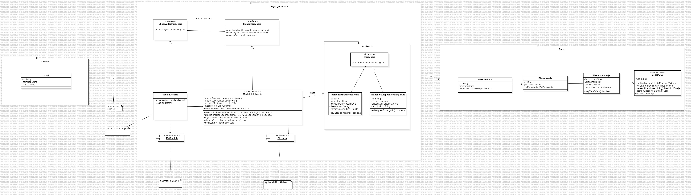

# IS-P1-G01 - Sistema de Monitoreo de Vías Ferroviarias

Primer proyecto de Ingeniería del Software - Grupo 01

## Descripción del Proyecto

Sistema de monitoreo inteligente para vías ferroviarias que detecta y predice incidencias mediante el análisis de señales eléctricas de dispositivos ubicados en las vías. El sistema permite:

- Lectura de mediciones de voltaje desde archivos CSV
- Detección automática de presencia de trenes en las vías
- Identificación inteligente de incidencias (dispositivos bloqueados, saltos de frecuencia)
- Sistema de suscripciones para notificaciones de incidencias
- Visualización gráfica de datos y incidencias
- API REST para integración con otros sistemas

## Requisitos del Sistema

### Requisitos Funcionales
- **R.F.1-5**: Gestión de dispositivos y vías ferroviarias
- **R.F.6**: Detección de presencia de trenes
- **R.F.7**: Módulo inteligente de detección de incidencias
- **R.F.8**: Sistema de suscripciones y notificaciones
- **R.F.9**: Módulo de visualización gráfica

### Requisitos de Dominio
- **R.D.1**: Aplicación web basada en HTTP/REST

Ver detalles completos en: [`Requisitos_Software.md`](Documentacion_proyecto/Requisitos_Software.md)

## Arquitectura del Sistema

El sistema está diseñado con una arquitectura en capas:

1. **Capa de Presentación (REST API)**: Controladores REST para exposición de servicios
2. **Capa de Lógica de Negocio (Services)**: Servicios y módulos inteligentes
3. **Capa de Acceso a Datos (Persistence)**: Repositorios para persistencia

### Paquetes Principales
- **DataAcquisition**: Lectura y gestión de mediciones de sensores
- **IncidentDetection**: Detección y predicción inteligente de incidencias
- **SubscriptionManagement**: Gestión de suscripciones y notificaciones
- **Visualization**: Generación de gráficas y visualizaciones
- **RestAPI**: Endpoints HTTP/REST
- **ServicesLayer**: Lógica de negocio
- **PersistenceLayer**: Acceso a base de datos

## Diagramas UML

El diseño incluye los siguientes diagramas UML:

## Roles del Equipo

Según la metodología del proyecto:
- **Analistas Software** (2 personas): Captura de requisitos
- **Arquitectos Software** (2 personas): Diseño UML
- **Jefe de Proyectos** (1 persona): Coordinación y metodología ágil

## Documentación Adicional

- **Especificación del proyecto**: [IS-P1-2025.md](Documentacion_proyecto/IS-P1-2025.md)
- **Manual de StarUML**: [Carpeta Documentacion_StarUML](Documentacion_StarUML/)

## Estado del Proyecto

-  Captura de requisitos funcionales
-  Captura de requisitos de dominio
-  Diseño de arquitectura del sistema
-  Diagrama de clases completo
-  Documentación de decisiones de diseño
-  Implementación en StarUML (en progreso)
-  Exportación de diagramas como imágenes
-  Memoria del proyecto

## Notas de Implementación

### Principios Aplicados
-  Principios SOLID
-  Separación de responsabilidades
-  Alta cohesión, bajo acoplamiento
-  Diseño orientado a interfaces
-  Extensibilidad y mantenibilidad

## Calendario

- **Semana 1** : Análisis y captura de requisitos
- **Semana 2**: Diseño de arquitectura
- **Semanas 3-4**: Refinamiento y documentación
- **Semana 5**: Finalización de documentación
- **Fecha límite**: 24/11 a las 11:00

## Contacto

Para consultas sobre este proyecto, contactar al jefe de proyecto del grupo.

---

**Universidad Rey Juan Carlos**  
Ingeniería del Software (IS, GIA)  
Curso 2025-2026 
